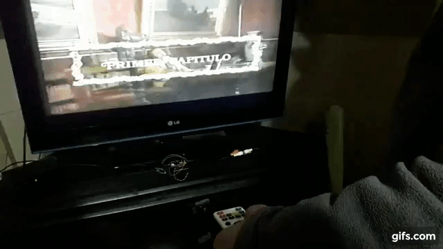

# ESPFLIX local

This work is based on the amazing **ESPFLIX** project by [@rossumur](https://github.com/rossumur) that you can visit at this link: https://github.com/rossumur/espflix

The goal of this implementation is to provide a way to generate local content to be streamed on ESPFLIX. This requires a specific folder tree structure, with videos compressed in **MPEG-1** (mpeg1video for video and sbc for audio).

In this tutorial we want to deliver content from **http://192.168.0.50/espflix/** but it could be any other URL. Same for the movie names, they could be anything. And the provided files ("manifest.txt" and "service.txt") are just an example.

**IMPORTANT: To run this project, you need the ESPFLIX deployed successfully on your ESP32, because this project only adjust a little bit the code. Check out @rossumur original project if you have questions about how to run ESPFLIX on an ESP32 microcontroller**.

[](https://youtu.be/1ppChsdcxHU)

# Requeriments
- indexer.cpp file (only to compile. You can also use the release version if you want)
- g++ compiler (only to compile)
- ffmeg utility (https://www.ffmpeg.org/)
- a web server
- lot of movies on MP4 format

# Compilation
Before compilation, check that the path for the **ffmpeg** program is correct. To do this, edit the "indexer.cpp" file and verify that the above line is correct for your environment.
```
const char* ffmpeg = "/usr/bin/ffmpeg";
```
If the path is not right, please change it to the right path to your ffmpeg installation.

Then, compile the "indexer.cpp" file with **g++** using the following command:
```
g++ indexer.cpp -o indexer
```
This command generate an **indexer** executable file. If you run this program without params you will see some information. 

This program will be used later.

# Input
## Videos
First, you need a source of MP4 videos to convert. Each video must have a PNG image to be used as a cover. Then, follow these streps:

- Select a folder of your choice to create the required structure (e.g. "Videos/espflix/mp4"). Folder names does not matter.
- Inside this selected folder create a folder named "media" (e.g. "Videos/espflix/mp4/media").
- Inside this "media" folder organize all your videos in a folder tree, creating a folder for each video and naming this folder with the name of the movie, and putting inside this folder the movie renamed as "video.mp4" and the cover renamed as "poster.png". **Please be sure that the movie name is short and has no spaces**

See the image for an example:


## Manifest
You need also a "manifest.txt" file indicating all your content. This file must be created at the same level of the "media" folder, and must include all movie folder names, line by line. For example, if you have the movies "capitulo1", "capitulo2" and "capitulo3" the manifest must be:

```
capitulo1
capitulo2
capitulo3
```
See the image for an example:


# Output
ESPFLIX requires a folder tree structure to stream video content. This structure must be hosted on your webserver. To do so, please follow this steps:

- Create a folder within your webserver to host the videos (e.g "/var/www/html/espflix").
- Inside this folder, create a "service" folder. This folder will contain all your videos
- At the same level create a "service.txt" file that includes one line with the URL of your ESPFLIX service on your webserver. For example (this depends on your local environment)

```
http://192.168.0.50/espflix/service/
```

See the image for an example:


# Processing

With the input videos and the output structure, you are ready to generate the required videos for ESPFLIX. To do so, execute the **indexer** program indicating the source folder where the videos are, and the target folder:
```
indexer Videos/espflix/mp4 /var/www/html/espflix/service
```
Please be patient, the process could take some time depending on the length of your videos. If the program works fine, you  will see an output folder tree with the following videos in each folder:
- video.ts, is the movie itself
- poster.ts, is the video for the cover
- video_fwd.ts, is the video when it is forwarded
- video_rwd.ts, is the video when it is rewinded
- video.idx, is an index video file required by ESPFLIX


# Streaming
Finally, to stream with ESPFLIX you need to change the **BOOT** defined in the "espflix.cpp" file on the Arduino project, with the URL of your local webserver. For example:
```
#define BOOT "http://192.168.0.50/espflix/service.txt"
```
Then, compile the project and deploy it again on your ESP32.

If everything works fine, you will see your videos streamed on ESPFLIX.

Enjoy !!!
